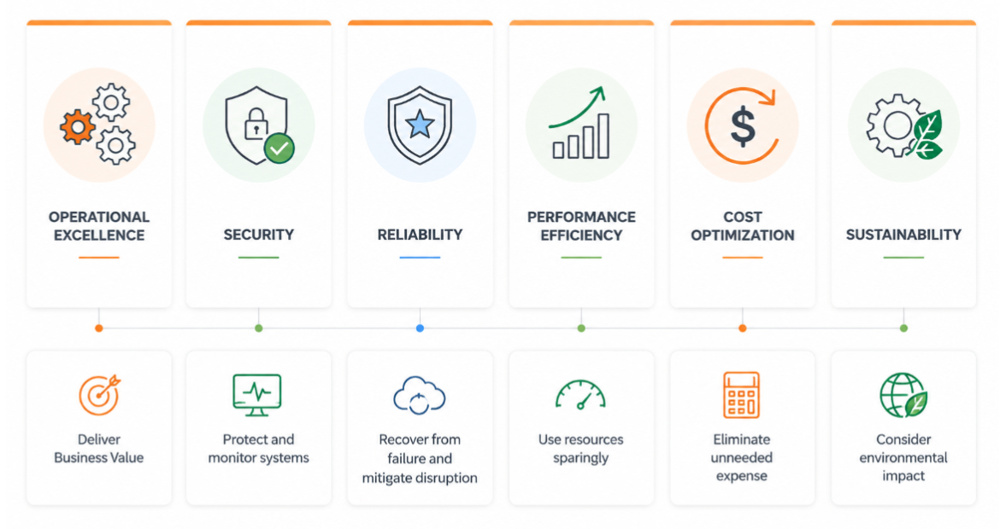

# Pillars of the Well-Architected Framework

# AWS Well-Architected Framework

The AWS Well-Architected Framework serves as a guide for consistently evaluating cloud architectures and offers guidance for implementing designs. It outlines a set of foundational questions and best practices that can help you determine if a specific architecture aligns with cloud best practices. AWS developed this framework after analyzing thousands of customer architectures on its platform.

The AWS Well-Architected Framework is structured around six pillars:

1. Operational Excellence
2. Security
3. Reliability
4. Performance Efficiency
5. Cost Optimization
6. Sustainability

**SAA Exam Tip:** All six pillars are fair game on the SAA-C03. The exam most frequently tests **Security**, **Reliability**, and **Cost Optimization**, usually through scenario questions that ask which design decision violates or upholds a given pillar. When you see a scenario describing a failure or outage, think Reliability. When you see unused instances or over-provisioned resources, think Cost Optimization. When you see data exposed without encryption, think Security.

# Operational Excellence 

### The ability to:
* Run and monitor systems that deliver business value.
* Continually improve supporting processes and procedures.
* Use IaC to define and update all parts of your workload

### Key topics:
* Manage and automate changes
* Respond to events
* Respond to change

Focuses on running systems efficiently, gaining operational insight, and continuously improving processes to deliver business value.

* Plan how workloads are deployed, updated, and managed.
* Reduce defects and enable quick, safe fixes through good engineering practices.
* Ensure observability via logging, instrumentation, and business/technical metrics.
* Treat the entire workload (apps, infrastructure, policies, governance, operations) as code.
* Applying code-based practices boosts productivity, cuts errors, and enables automated responses.

**SAA Exam Tip:** Operational Excellence services to know: **CloudWatch** (monitoring + alarms), **CloudFormation/CDK** (IaC), AWS Systems Manager (automated runbooks, patch management), and **AWS X-Ray** (distributed tracing). If a scenario asks how to reduce manual operational overhead or improve deployment consistency, this pillar is in play.

# Security

## The ability to:

* Implement a strong identity foundation
* Maintain traceability
* Apply security at all layers
* Implement risk assessment and mitigation strategies
* The Security pillar focuses on the ability to protect information, systems, and assets while delivering business value by conducting risk assessments and implementing mitigation strategies.

To establish a robust security posture for your architecture, it’s essential to implement a strong identity foundation, ensure traceability, apply security measures across all layers, automate security best practices, and protect data both in transit and at rest. Adhering to these security principles helps you prepare effectively for potential security events.

**SAA Exam Tip:** Security services to know for the exam: **IAM** (least privilege, roles, policies), **AWS KMS** (encryption key management), **CloudTrail** (audit logging the key to "maintain traceability"), **GuardDuty** (intelligent threat detection), **Security Hub** (aggregated findings), and **AWS WAF** (web app firewall). Anti-pattern: using long-lived access keys instead of IAM roles. Any scenario mentioning audit, compliance, or data protection traces back to this pillar.

# Reliability

## The ability of a system to:

* Recover from infrastructure or service failures
* Dynamically acquire computing resources to meet demand
* Mitigate disruptions
* The Reliability pillar focuses on a system's ability to recover from infrastructure or service disruptions and dynamically scale computing resources to meet demand. It * also covers the system's capacity to mitigate disruptions like misconfigurations or transient network issues.

Ensuring reliability in a traditional environment can be challenging due to factors like single points of failure, lack of automation, and limited elasticity. By following the best practices outlined in the Reliability pillar, many of these issues can be prevented. This pillar helps you and your customers design an architecture that emphasizes high availability, fault tolerance, and overall redundancy.

**SAA Exam Tip:** Reliability = Multi-AZ architecture. Key services: **RDS Multi-AZ** (automatic failover for databases), **Elastic Load Balancer** (distribute traffic across healthy instances), **Auto Scaling Groups** (replace unhealthy instances), **Route 53 health checks** (DNS failover), and **S3** (11 nines of durability through redundant storage). If a scenario asks about "surviving a data center failure" or "automatic recovery" the answer usually involves ELB + ASG + Multi-AZ deployments.

# Performance Efficiency

## The ability to:

* Choose and maintain efficient resources.
* Democratize advanced technologies
* Employ mechanical sympathy
* Maintain that efficiency as demand changes and technologies evolve.
* When focusing on performance, the goal is to maximize efficiency in using computational resources while maintaining that efficiency as demand fluctuates.

It's also crucial to make advanced technologies accessible. If implementing a technology yourself is complex, consider leveraging a vendor. By handling the complexity and expertise, the vendor allows your team to concentrate on more value-added work.

Mechanical sympathy refers to using a tool or system with a deep understanding of how it operates most effectively. Choose the technology approach that best aligns with your objectives. For instance, consider data access patterns when selecting database or storage solutions.

**SAA Exam Tip:** Performance Efficiency is about choosing the right resource, not the most powerful one. Key decision points: **EC2 instance families** (compute-optimized C-family, memory-optimized R-family, storage-optimized I-family), **ElastiCache** for offloading repeated database reads, **CloudFront** for serving content with low latency, **RDS Read Replicas** for scaling read-heavy workloads. If a scenario says performance is degrading under read load think read replicas or caching, not bigger instances.