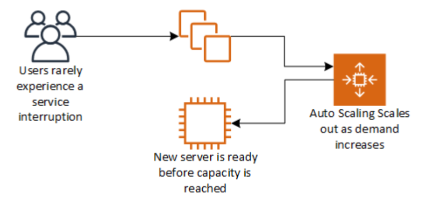
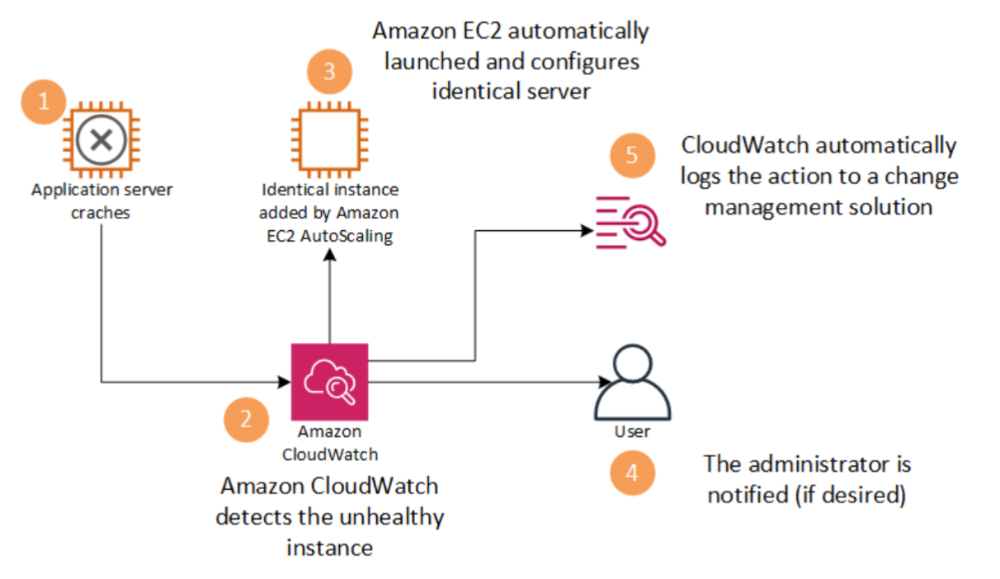
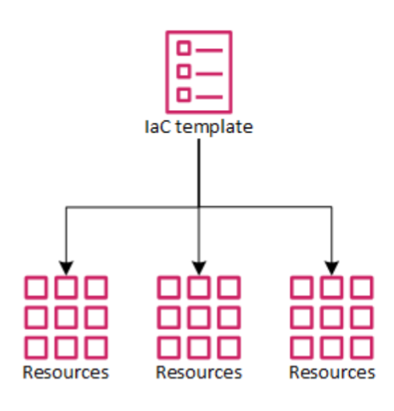
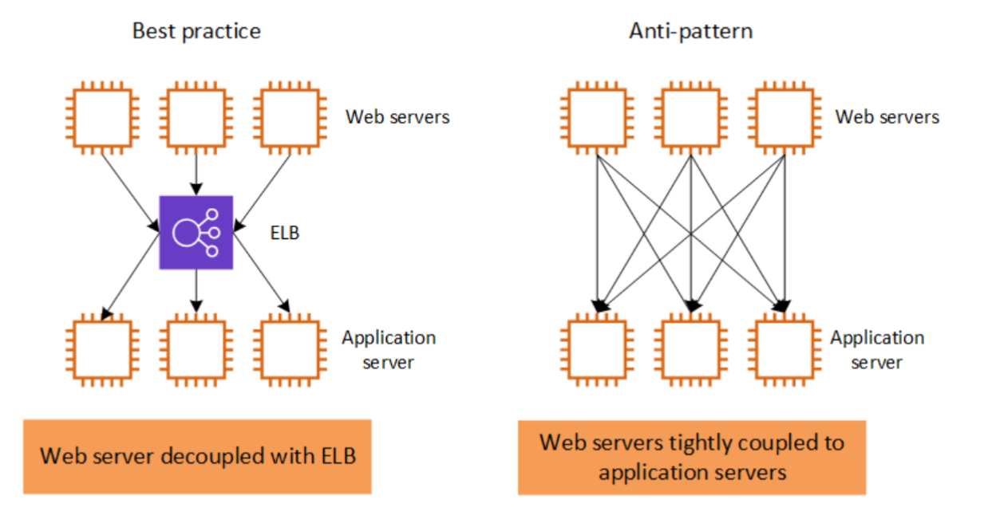
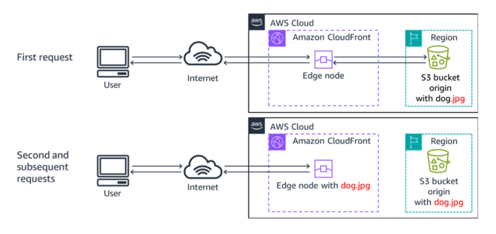

# Best practices for building solutions on AWS

## Design trade-offs

When designing a solution, trade-offs are essential for optimizing performance, cost, and efficiency. You may sacrifice consistency or durability for speed or prioritize faster deployment over cost savings.

However, these trade-offs can increase complexity and expenses, so decisions should be based on empirical data, such as load testing and benchmarking.

It's crucial to assess how design choices impact both customers and workload efficiency. This section covers AWS best practices for solution design and common mistakes (anti-patterns) to avoid.

## Implementing scalability

* Ensure that your architecture can handle changes in demand

* Scalability is crucial when running workloads on AWS, ensuring infrastructure can meet demand proactively

Implementing scalability at every layer helps prevent capacity issues before they become critical. **Amazon CloudWatch** can monitor system load and trigger **Amazon EC2 Auto Scaling**, which launches new instances before capacity is maxed out, maintaining a seamless user experience.

**SAA Exam Tip:** Know the three Auto Scaling policy types: **Target Tracking** (simplest maintain a metric like 60% CPU), **Step Scaling** (react to thresholds in steps), and **Scheduled Scaling** (predictable traffic patterns). Target Tracking is the recommended default.

## Automating your environment

Automate the provisioning, termination, and configuration of resources

**Amazon CloudWatch** and **EC2 Auto Scaling** automate failure detection, replace unhealthy resources, and send notifications when resource changes occur.

For example, if an application server crashes, CloudWatch detects the failure, launches a new server, configures it, and notifies the administrator while logging the change for tracking.

## Using IaC
Provision your computing infrastructure using code instead of manual processes.

 * Rapidly deploy duplicate environments.
 * Reduce configuration errors from manual configuration.
 * Propagate changes consistently to all stacks.

**Infrastructure as Code (IaC)** automates infrastructure deployment, reducing manual effort and errors. It enables rapid deployment of identical environments using templates, eliminating repetitive tasks.

## AWS IaC options:

**AWS CloudFormation** AWS-native, JSON/YAML templates, supports StackSets for multi-account/multi-Region deployments.

**AWS CDK (Cloud Development Kit)** Define infrastructure in Python, TypeScript, or Java compiles to CloudFormation

**Terraform** Multi-cloud IaC, widely used in production environments.

**SAA Exam Tip:** The exam focuses on **CloudFormation**. 
Know that StackSets allow you to deploy the same stack across multiple accounts and Regions in one operation. This is the answer for any multi-account governance question.

## Treating resources as disposable

It means managing infrastructure like software rather than hardware. Instead of overprovisioning costly physical resources, this approach enables seamless scaling, upgrades, and management by quickly replacing instances as needed. It improves flexibility, cost efficiency, and responsiveness to changing capacity demands.

**SAA Exam Tip:** Disposable resources require **stateless** application design instances must not store anything locally that can’t be recreated. State belongs in managed services: user sessions → **ElastiCache (Redis)**, uploaded files → **S3**, application data → **RDS or DynamoDB**. If an instance can be terminated and a new one can take over without data loss, you’ve implemented this principle. Auto Scaling Groups only work reliably when instances are stateless.

## Using loosely coupled components

**Loose coupling** improves system reliability and scalability by using managed solutions like **load balancers** and **message queues** as intermediaries between system layers. Unlike traditional tightly integrated infrastructures, where failures in one component can disrupt the entire system, loose coupling allows independent scaling and automatic failure handling.

## Designing services, not servers

**SAA Exam Tip:** The most-tested "services not servers" decision is **Lambda vs EC2**. Prefer Lambda when the workload is event-driven, short-duration (under 15 minutes), and has unpredictable or spiky traffic. Prefer EC2 when you need persistent processes, custom runtimes, or long-running jobs. For databases: **RDS** over self-managed MySQL on EC2 (RDS provides automated backups, patching, Multi-AZ, and read replicas out of the box).

## Choosing the right database solution
 * Match technology to the workload, not the other way around
 * Read and write needs
 * Total storage requirements
 * Typical object size and nature of access to these objects
 * Durability requirements
 * Latency requirements
 * Maximum concurrent users to support
 * Nature of queries
 * Required strength of integrity controls

**SAA Exam Tip:** Database selection is one of the highest-frequency topics on the SAA-C03. Quick decision guide:

**RDS / Aurora →** relational data (SQL), managed, automated backups and failover. Aurora is up to 5× faster than standard MySQL.
DynamoDB → key-value / document, single-digit millisecond latency at any scale, fully serverless.

 **Redshift →** analytics and data warehousing (OLAP workloads, not OLTP).

 **ElastiCache (Redis or Memcached) →** in-memory caching to offload read  pressure from databases.

 **Neptune →** graph database (social networks, fraud detection,  recommendation engines).

 **DocumentDB →** MongoDB-compatible document database.

Anti-pattern: using a relational database for a workload that only needs simple key-value lookups at high scale — DynamoDB will be cheaper and faster.

## Avoiding single points of failure

**Eliminating single points of failure** ensures system resilience by preventing downtime from component failures. Instead of duplicating everything, **automated scaling or managed services** can replace failed components as needed.

**SAA Exam Tip:** Know the three failure-resilience tiers the exam tests:

  **Multi-AZ →** high availability within a single Region; automatic   failover. Use for production databases (RDS Multi-AZ), ELB + ASG spanning   2+ AZs.

  **Read Replicas →** performance scaling for read-heavy workloads; NOT a failover mechanism (manual promotion required).

  **Multi-Region →** disaster recovery across geographic regions; higher   cost + complexity. Used when RPO/RTO requirements are very aggressive or   compliance requires geographic separation.

Anti-pattern: running a single RDS instance with no Multi-AZ in a production environment.

# Optimizing for cost

Take advantage of the flexibility of AWS to increase your cost efficiency.

   * Are my resources the right size and type for the job?
   * Which metrics should I monitor?
   * How do I turn off resources that are not in use?
   * How often will I need to use this resource?
   * Can I replace any of my servers with managed services?

**SAA Exam Tip:** Cost optimization levers, from most to least frequently tested:

   **1. Spot Instances** up to 90% savings; use for stateless, fault-tolerant batch workloads (Spot can be interrupted with 2-min notice).

   **2. Reserved Instances** / Savings Plans 1 or 3 year commitment; best for steady baseline workloads. Savings Plans are more flexible (apply across instance families/regions).

   **3. Right-sizing AWS Compute Optimizer** analyzes CloudWatch metrics and recommends the optimal instance type. **Trusted Advisor** also flags underutilized resources.

   **4. S3 Intelligent-Tiering** automatically moves objects between tiers based on access patterns; ideal when you can’t predict access frequency.

   **5. Scheduling** stop/start non-production environments on a schedule using AWS Instance **Scheduler** or Lambda.

## Using caching

Minimize redundant data retrieval operations, improving performance and cost.

**SAA Exam Tip:** 
Know your caching layers: 
**CloudFront** for static/dynamic content at the edge, **ElastiCache (Redis)** for session data and database query results, **DAX** for DynamoDB read acceleration. If a question mentions reducing database load or read latency, caching is the answer.

## Sercuring your entire infrastructure

Build security into every layer of your infrastructure.

   * Use managed services.

   * Log access of resources.

   * Isolate parts of your infrastructure.

   * Encrypt data in transit and at rest.

   * Enforce access control granularly, using the principle of least privilege.

   * Use multi-factor authentication (MFA).

   * Automate your deployments to keep security consistent.

**Security** goes beyond perimeter protection; it also involves securing    individual environments and components.

**Amazon EC2 security groups** control inbound and outbound traffic by specifying allowed ports and sources.

This helps **isolate instances**, reducing the risk of security threats spreading. Similar security measures should be applied across all AWS services.

**SAA Exam Tip:** Know the difference between **Security Groups** (stateful, instance-level, allow rules only) and **NACLs** (stateless, subnet-level, allow and deny rules). Security Groups are the more common exam answer for instance-level access control.

# Summary

As you design solutions, evaluate trade-offs and base your decisions on empirical data.

Follow these best practices when building solutions on AWS:

   * Implement scalability.
   * Automate your environment.
   * Treat resources as disposable.
   * Use loosely-coupled components.
   * Design services, not servers.
   * Choose the right database solution.
   * Avoid single points of failure.
   * Optimize for cost.
   * Use caching.
   * Secure your entire infrastructure.