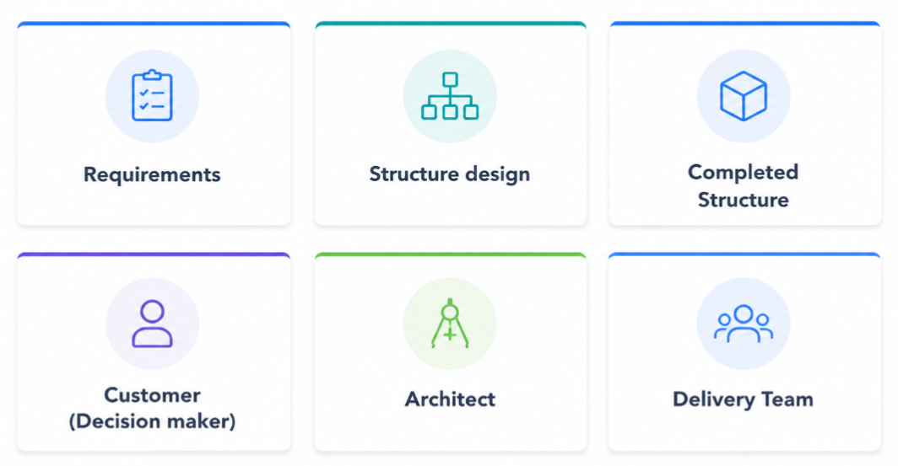

# Key Components of Cloud Architecture Planning

Cloud architecture involves the practice of applying cloud characteristics to create solutions that leverage cloud services and features to fulfill an organization's technical and business requirements.

Creating technology solutions is similar to constructing a physical building. If the foundation isn't strong, it can lead to structural issues that compromise the building's integrity and functionality. To construct a sturdy building, the customer specifies the needs and requirements, and the architect designs blueprints that meet those needs. The construction crew then transforms these blueprints into a physical structure.

Similarly, in cloud architecture, the customer or decision-maker outlines business objectives and requirements. The cloud architect then designs a solution, akin to a building blueprint. The delivery team is responsible for implementing this solution.

Having well-architected systems increases the chances that the technology deliverables will align with and support the business goals.

**SAA Exam Tip:** On the exam, you are essentially being tested as a cloud architect. Each scenario question gives you a set of business/technical requirements and asks you to pick the architecture that best meets them. Thinking in terms of "what does this customer actually need" — not "what is the most sophisticated solution" is the right mindset.

The role of a cloud architect includes:

* Engaging with decision-makers to identify business goals and areas needing improvement.
* Ensuring that the technology deliverables of a solution are aligned with the business objectives.
* Collaborating with delivery teams to ensure the technology features being implemented are suitable.

Cloud architects manage an organization's cloud computing architecture. They possess in-depth knowledge of architectural principles and services to:

* Develop a technical cloud strategy based on business needs.
* Assist with cloud migration efforts.
* Review workload requirements.
* Provide guidance on addressing high-risk issues.

Cloud architects also work to implement the AWS Well-Architected Framework.

**SAA Exam Tip:** Cloud architects are not just technically focused they are responsible for ensuring technical decisions serve business goals. On the SAA exam, always read the business requirement in a scenario question carefully. The "right" answer is the one that best satisfies the stated requirement, not the most technically complex one.